#  Czesc, jestem Kacper

<p align="center">
  
</p>

<p align="center">
  
</p>

<p align="center">
  <a href="https://github.com/Kacpherek">
    
  </a>
  
</p>

## O mnie

```ts
const kacper = {
  role: "Frontend / Fullstack Developer",
  location: "Poland",
  focus: ["React", "TypeScript", "Node.js", "UI/UX", "Automation"],
  currentMission: "Build things that are fast, clean and memorable"
}
```

## Tech stack

<p>
  
</p>

## GitHub Metrics

<p align="center">
  
</p>

<p align="center">
  
  
</p>

## Co teraz robie

- Tworze ladne i wydajne interfejsy webowe
- Usprawniam workflowy i automatyzacje CI/CD
- Rozwijam portfolio projektow open-source

---

<p align="center">
  <i>Built and generated with lowlighter/metrics</i>
</p>
